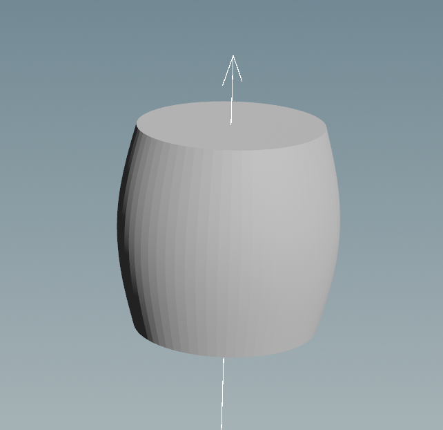
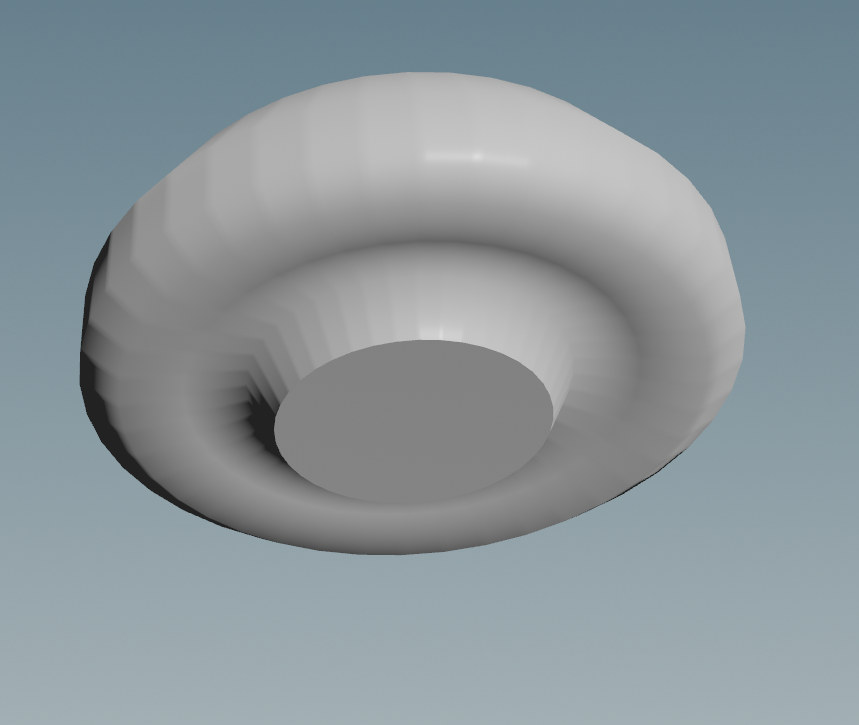
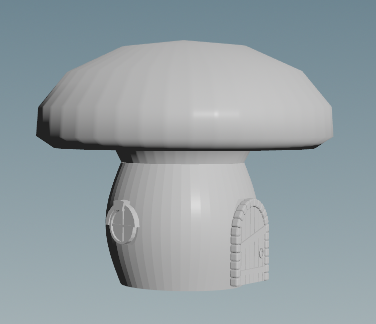
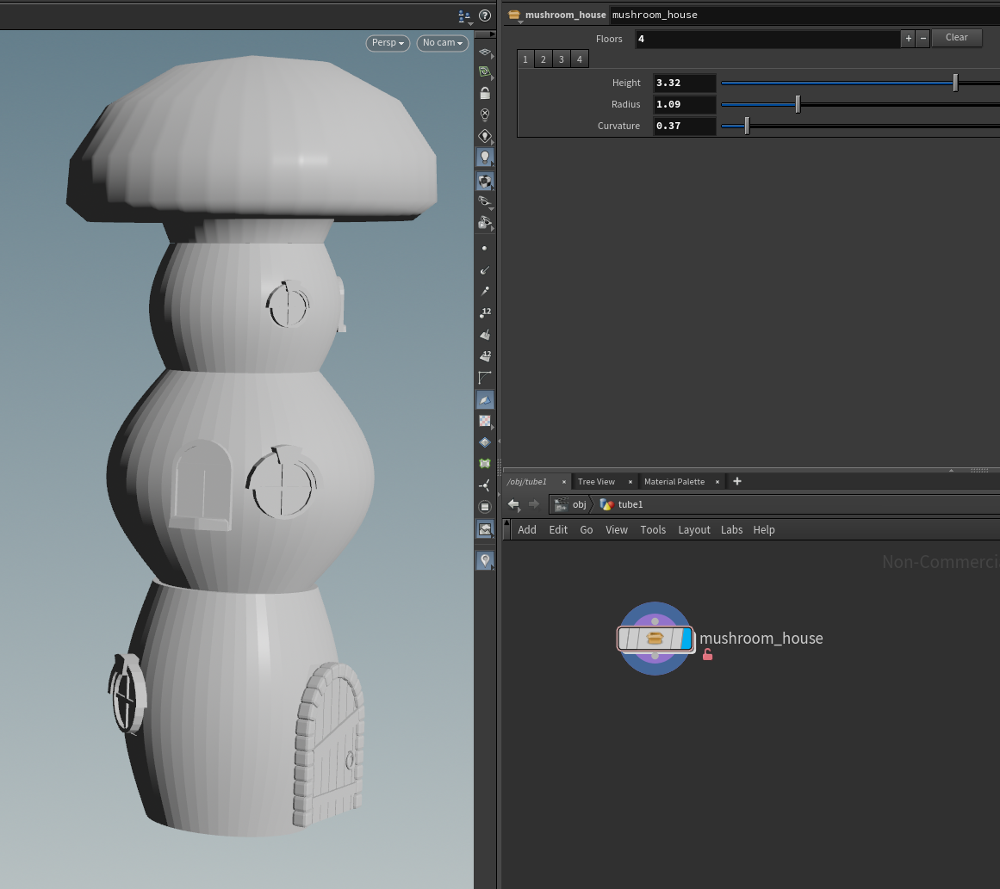

# CIS 5660 HW04 Procedural Buildings

## Project Overview
To gain more experience with tool creation and loops, create a multi-floor building generator.

## Reference and Assets
### Building theme reference

  

I've chosen to create a tool for Mushroom House.

### Gather the assets
Trunk and cap of the mushroom house are generated though line/curve + revolve along with other minor optimazation nodes.
  

Door and windows assets are found on the internet, credited as followed:
[Door](https://sketchfab.com/3d-models/door-7842a51cc1f2454aa0265acc015717c0)
[Window](https://sketchfab.com/3d-models/stylized-cartoon-windows-22f58cb5690744e39052bb5c1fd52267)

## Inside the Loop
### Loop body
Each iteration of the loop create a floor for the building, putting together assets mentioned above. The last (top-most) floor is always the mushroom cap.

 

### Controls
With the tool, one can add or remove floors to the building, and each floor has it's own control panel for height, radius, and curvature.

 

## Building construction demo
[Demo](https://youtu.be/ArhFgAUdYLk)
